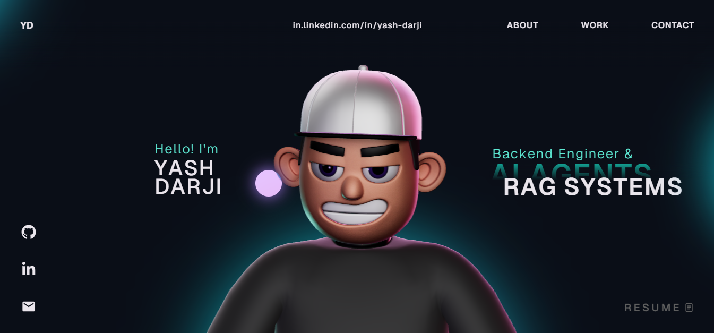

# Yash Darji — 3D Portfolio

**Live site: [yash-builds-ai.netlify.app](https://yash-builds-ai.netlify.app/)**

Personal portfolio built with React, TypeScript, Three.js, React Three Fiber, and GSAP. Features a 3D character scene, scroll-driven animations, custom cursor interactions, and a project showcase.



## Table of Contents

- [Features](#features)
- [Tech Stack](#tech-stack)
- [Project Structure](#project-structure)
- [Getting Started](#getting-started)
- [Available Scripts](#available-scripts)
- [GSAP License Note](#gsap-license-note)
- [Deployment](#deployment)
- [Credits](#credits)
- [License](#license)

## Features

- Responsive one-page portfolio layout with reusable section components.
- 3D character scene rendering powered by React Three Fiber and Three.js.
- GSAP-powered animations and scroll-driven transitions.
- Custom cursor, hover interactions, and smooth scroll effects.
- Project carousel with images, stack tags, and GitHub/demo links.
- Interactive 3D tech stack ball physics simulation.

## Tech Stack

### Core

- React 18
- TypeScript
- Vite

### Animation and 3D

- GSAP + `@gsap/react`
- Three.js
- `@react-three/fiber`
- `@react-three/drei`
- `@react-three/postprocessing`
- `@react-three/rapier`

### Supporting Libraries

- `react-icons`
- `react-fast-marquee`

## Project Structure

```text
.
├── public/                    # Static assets (images, models, draco)
├── src/
│   ├── components/
│   │   ├── Character/         # 3D scene + character logic/utilities
│   │   ├── styles/            # Section/component CSS files
│   │   ├── About.tsx
│   │   ├── Career.tsx
│   │   ├── Contact.tsx
│   │   ├── Landing.tsx
│   │   ├── MainContainer.tsx
│   │   ├── Navbar.tsx
│   │   ├── TechStack.tsx
│   │   ├── WhatIDo.tsx
│   │   └── Work.tsx
│   ├── context/
│   ├── data/
│   ├── App.tsx
│   └── main.tsx
├── package.json
└── vite.config.ts
```

## Getting Started

### Prerequisites

- Node.js 18+
- npm 9+

### Installation

1. Clone the repository:

   ```bash
   git clone https://github.com/yshraj/yash-darji-portfolio.git
   cd yash-darji-portfolio
   ```

2. Install dependencies:

   ```bash
   npm install
   ```

3. Start the dev server:

   ```bash
   npm run dev
   ```

4. Open `http://localhost:5173` in your browser.

## Available Scripts

- `npm run dev` — Start Vite dev server
- `npm run build` — Type-check and build for production
- `npm run preview` — Preview production build locally
- `npm run lint` — Run ESLint

## GSAP License Note

This project uses the standard `gsap` package including bonus plugins available in the core.

Read the official guide: [GSAP Installation Docs](https://gsap.com/docs/v3/Installation/)

## Deployment

```bash
npm run build
```

Deploy the `dist/` folder to Netlify, Vercel, or Cloudflare Pages.

## Credits

3D portfolio template originally created by [Akash Malhotra](https://github.com/akashrmalhotra/3d-portfolio). Customised and extended for Yash Darji's personal portfolio.

## License

This project is open source and available under the [MIT License](LICENSE).
